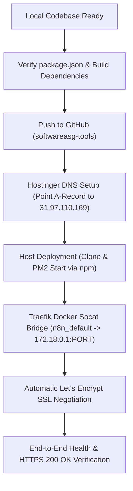

# Skill: Hostinger VPS Web Application Deployer

## Trigger
Invoke this skill whenever the user says:
- *"take this website live on hostinger"*
- *"deploy to hostinger vps"*
- *"make this website live from localhost to domain"*
- *"deploy with github and hostinger"*
- *"take [domain] live"*

---

## 1. System Architecture Overview

This VPS uses a **hybrid PM2 + Traefik Docker Bridge** architecture:
- **Server IP**: `31.97.110.169` (Hostinger KVM 2, Ubuntu 24.04).
- **Edge Reverse Proxy**: Traefik (`n8n-traefik-1`) running in Docker on ports `80` and `443` on the `n8n_default` Docker network.
- **SSL Management**: Traefik automatically issues free Let's Encrypt SSL certificates using `mytlschallenge`.
- **Application Execution**: Apps run directly on the host using **PM2** on dedicated, isolated ports.
- **Network Bridge**: Lightweight `alpine/socat` containers bridge Traefik's Docker network to the host application on `172.18.0.1:<PORT>`.

### Port Allocation Registry
| Port | Application | Mode | Status |
| :--- | :--- | :--- | :--- |
| `5678` | **n8n** | Docker | Core Production |
| `14000` | **taskwhite.com** | Host PM2 (id 1) | Core Production |
| `20000` | **dpnranker.com** | Host PM2 (id 0) | Core Production |
| `30000` | **ganeshmandal.in** | Host PM2 (id 4) | Core Production |
| `31000+` | **Next New Applications** | Host PM2 | Assign sequentially |

> [!CAUTION]
> **Zero-Disruption Directive**: NEVER stop, restart, or alter ports `5678`, `14000`, or `20000`. Never edit `/docker/n8n/docker-compose.yml` directly without a backup.

---

## 2. Phase-by-Phase Deployment Workflow



---

### Phase 1: Local Code Verification & GitHub Push

1. **Verify Production Dependencies**:
   Ensure all packages needed at runtime (such as `express`, `ws`, `cors`) are in `"dependencies"` of `package.json`, NOT `"devDependencies"` (which are ignored during production install).

2. **Push to GitHub**:
   - Organization: `https://github.com/softwareasg-tools/<repo-name>`
   - If using collaborator account `IB-DPNStudio`:
     - Verify collaborator invitation accepted: `https://github.com/softwareasg-tools/<repo-name>/invitations`.
     - Push from local terminal:
       ```bash
       git remote set-url origin https://github.com/softwareasg-tools/<repo-name>.git
       git branch -M main
       git push -u origin main
       ```

---

### Phase 2: Hostinger DNS Configuration

In Hostinger hPanel -> **Domains** -> Select `<domain>` -> **DNS / Nameservers**:
1. Add/Update **A Record**:
   - **Type**: `A`
   - **Name**: `@`
   - **Points to**: `31.97.110.169`
   - **TTL**: `300`
2. Add/Update **CNAME Record**:
   - **Type**: `CNAME`
   - **Name**: `www`
   - **Points to**: `<domain>` (or `31.97.110.169`)
   - **TTL**: `300`

Verify from terminal:
```bash
node -e "const dns = require('dns'); const r = new dns.promises.Resolver(); r.setServers(['8.8.8.8']); r.resolve4('<domain>').then(console.log);"
```

---

### Phase 3: Host Deployment with PM2 (Zero Disruption)

1. Open Hostinger **Web Console** for `srv906162.hstgr.cloud`.
2. Inspect existing ports to pick the next free port:
   ```bash
   ss -tulpn | grep LISTEN
   pm2 list
   ```
3. Clone and install dependencies:
   ```bash
   APP_NAME="<app-name>"
   APP_PORT="<assigned-port>" # e.g. 31000
   
   rm -rf /opt/$APP_NAME
   git clone https://github.com/softwareasg-tools/$APP_NAME.git /opt/$APP_NAME
   cd /opt/$APP_NAME
   npm ci --omit=dev
   ```
4. Start via PM2 using `npm start` (crucial for ES Module support and clean auto-restarting):
   ```bash
   PORT=$APP_PORT pm2 start npm --name $APP_NAME -- start
   pm2 save
   ```
5. Verify local host response:
   ```bash
   curl -I http://127.0.0.1:$APP_PORT
   ```

---

### Phase 4: Traefik Bridge & Automatic SSL

Connect the new host application to Traefik via an isolated `socat` container on the `n8n_default` network.

```bash
DOMAIN="<domain>"          # e.g. example.in
APP_NAME="<app-name>"      # e.g. example
APP_PORT="<assigned-port>"  # e.g. 31000

# 1. Detect Traefik network gateway (usually 172.18.0.1)
GATEWAY_IP=$(docker network inspect n8n_default --format '{{(index .IPAM.Config 0).Gateway}}')

# 2. Stop previous bridge container if exists
docker rm -f n8n-$APP_NAME-1 2>/dev/null || true

# 3. Launch isolated Traefik bridge container
docker run -d \
  --name n8n-$APP_NAME-1 \
  --restart always \
  --network n8n_default \
  --label "traefik.enable=true" \
  --label "traefik.http.routers.$APP_NAME.rule=Host(\`$DOMAIN\`) || Host(\`www.$DOMAIN\`)" \
  --label "traefik.http.routers.$APP_NAME.tls=true" \
  --label "traefik.http.routers.$APP_NAME.tls.certresolver=mytlschallenge" \
  --label "traefik.http.services.$APP_NAME.loadbalancer.server.port=80" \
  alpine/socat tcp-listen:80,fork,reuseaddr tcp-connect:$GATEWAY_IP:$APP_PORT
```

Traefik will immediately:
1. Detect the new container.
2. Route `http://$DOMAIN` (301 redirect to HTTPS).
3. Contact Let's Encrypt via TLS challenge and issue an official SSL certificate.
4. Route all encrypted HTTPS traffic directly to the host application.

---

### Phase 5: Verification Checklist

Execute automated verification:
```bash
node -e "fetch('https://<domain>', { headers: { 'User-Agent': 'Node' } }).then(async r => { console.log('HTTPS Status:', r.status); const text = await r.text(); console.log('Payload size:', text.length); }).catch(console.error);"
```

Verify existing apps:
```bash
pm2 list
# Confirm dpnranker (0), taskwhite (1), and existing apps are still online with unchanged uptime!
```

---

## 3. Maintenance Playbook for Existing Deployed Apps

### Updating Code on the Server
When new code is pushed to GitHub:
```bash
cd /opt/<app-name>
git pull
npm ci --omit=dev
pm2 restart <app-name>
```

### Viewing Real-Time Logs
```bash
pm2 logs <app-name> --lines 50
```

### Checking Traefik Routing
```bash
docker logs --tail 30 n8n-traefik-1
```
